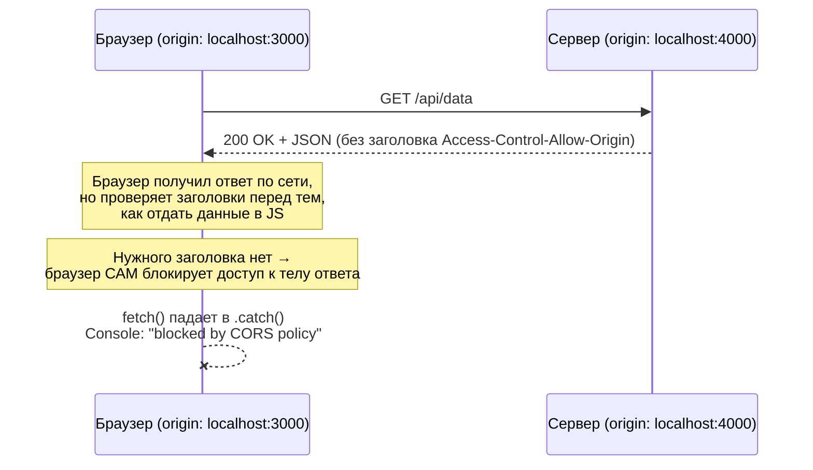
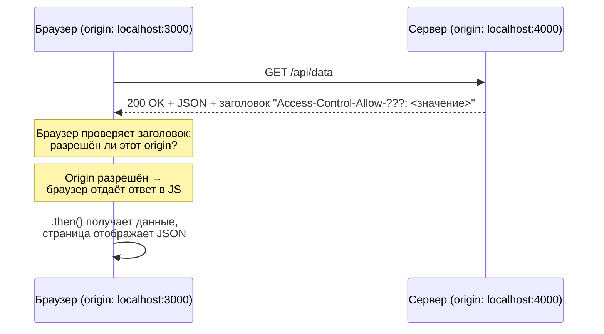

# CORS Playground — почему падает и что должно произойти

**Прогресс по roadmap:** пройдено 1 из 6 версий (осталось: 5)

- Сделано: v1.0
- Следующая версия: v1.1 — открой ветку `git checkout v1.1-broken`

## Участники

- **Фронтенд** — `http://localhost:3000`
- **Бэкенд** — `http://localhost:4000`

Это два разных origin (разный порт), поэтому браузер применяет к запросу между ними Same-Origin Policy.

---

## ДО фикса — почему появляется ошибка

**Важно понимать:**

- Сервер не сломан и не упал — он честно отвечает 200 OK, данные реально уходят по сети (это видно во вкладке Network).
- Ошибку создаёт не сервер и не сеть — её создаёт **браузер**, уже после получения ответа, на основе того, чего не хватает в заголовках.
- CORS — это не баг, а защитный механизм: без него любая страница в интернете могла бы тихо читать ответы с любого другого сайта, где у пользователя есть сессия.

---

## ПОСЛЕ фикса — что должно произойти

**Что должно измениться на стороне сервера:**

- В ответ добавляется заголовок, который явно говорит браузеру: "этому origin можно читать мой ответ".
- Имя заголовка — то самое, что браузер называет в тексте ошибки в консоли (`No '???' header is present`).
- Значение — конкретный origin фронтенда, либо специальное значение "разрешить всем" (у него есть свои ограничения, особенно с cookies/credentials — это будет отдельная версия, v2.0).

**Как понять, что фикс сработал:**

- Ошибка в Console исчезает.
- Во вкладке Network у ответа появляется нужный заголовок (Response Headers).
- На странице вместо `Error: ...` отображается JSON от сервера.

---

## Ключевая идея на будущее

Фронтенд **никогда** не может починить CORS-ошибку сам — ни настройками fetch, ни `mode: 'no-cors'` (это просто прячет ошибку, но и данные ты тоже не получишь). Разрешение всегда выдаёт сервер через заголовки ответа. Задача фронтенда — правильно прочитать ошибку и понять, чего именно не хватает.
