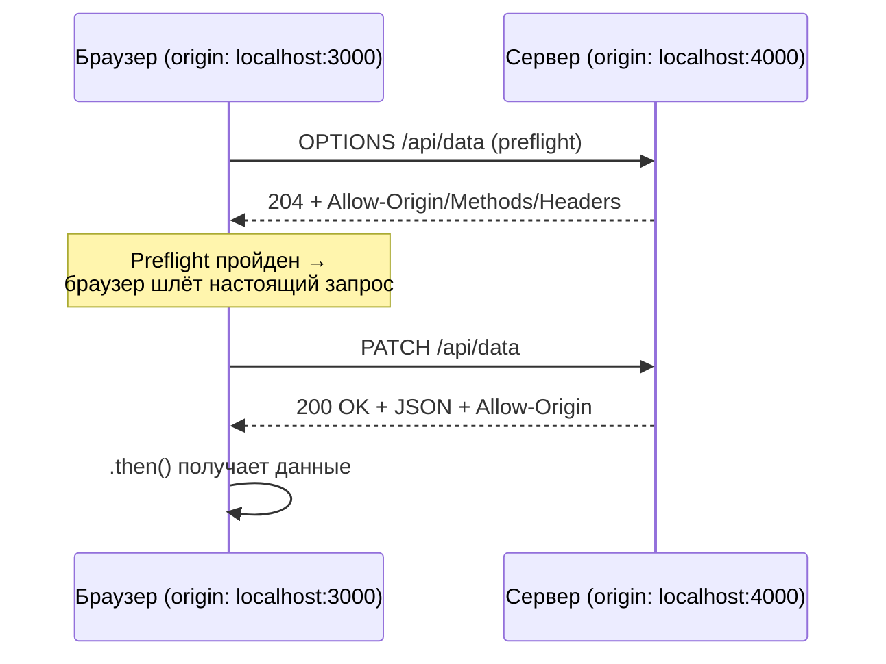

# CORS Playground — v1.2: preflight-запрос падает

**Прогресс по roadmap:** пройдено 3 из 6 версий (осталось: 3)

- Сделано: v1.0, v1.1, v1.2
- Следующий шаг: v2.0 — открой ветку `git checkout v2.0-broken`

## Участники

- **Фронтенд** — `http://localhost:3000`
- **Бэкенд** — `http://localhost:4000`

## Условие

Заголовок `Access-Control-Allow-Origin` настроен правильно (v1.1 решена) — но теперь фронт делает `PATCH`-запрос с `Content-Type: application/json`, и в консоли снова ошибка `blocked by CORS policy`.

Открой вкладку Network **до** того, как читать дальше — там сейчас происходит что-то, чего не было в v1.0 и v1.1.

## Задача

1. Посмотри на Network: сколько запросов реально ушло к `/api/data` — один или два? Какой из них падает?
2. Раскрой упавший запрос → Headers → General → `Request Method`. Что это за метод?
3. Погугли/вспомни: что такое preflight-запрос и когда браузер решает его отправлять (какие условия делают запрос «непростым» — non-simple request).
4. Почини на сервере — [server/server.js](server/server.js). Роут `app.patch('/api/data', ...)` уже существует, но браузер не может до него достучаться.

**Подсказка, если застрял:** preflight — это отдельный HTTP-запрос методом `OPTIONS`, который браузер посылает сам, без твоего кода. Сервер должен на него явно ответить: подтвердить origin **и** перечислить, какие методы/заголовки он разрешает в реальном запросе.

**Как понять, что фикс сработал:** в Network появляется `OPTIONS`-запрос со статусом `2xx`, следом — успешный `PATCH`, ошибка в Console исчезает.

---

## Решение

Express действительно отвечал на `OPTIONS /api/data` — но автоматическим ответом `200 OK` с заголовком `Allow: GET,HEAD,PATCH` и без единого `Access-Control-*` заголовка. Для браузера это провал preflight-проверки: он не видит подтверждения ни origin, ни метода, ни заголовка — и блокирует реальный `PATCH`, даже не отправляя его на сервер.

Фикс — явный `app.options('/api/data', ...)`, который отвечает на preflight тремя заголовками:

- `Access-Control-Allow-Origin` — тот же самый, что и на обычных ответах.
- `Access-Control-Allow-Methods` — какие HTTP-методы разрешены для этого пути.
- `Access-Control-Allow-Headers` — какие кастомные заголовки (здесь — `Content-Type`) разрешено слать в реальном запросе.

**Вывод:** preflight существует не для всех запросов — только для «непростых» (non-simple): методы кроме `GET/HEAD/POST`, кастомные заголовки, или `Content-Type` отличный от нескольких безопасных значений. Простой `fetch(url)` из v1.0/v1.1 preflight не запускал вовсе — поэтому там всё решалось одним заголовком на самом ответе.
