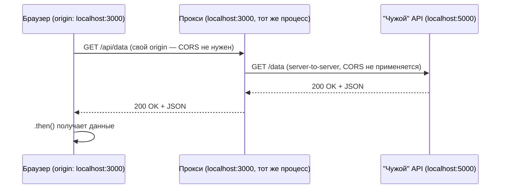

# CORS Playground — v3.0: когда заголовки не вариант

**Прогресс по roadmap:** пройдено 6 из 6 версий (осталось: 0)

- Сделано: v1.0, v1.1, v1.2, v2.0, v2.1, v3.0
- Следующая версия: нет — это последняя версия, весь roadmap пройден

## Участники

- **Фронтенд** — `http://localhost:3000`
- **"Чужой" API** — `http://localhost:5000` — представь, что это сторонний сервис (партнёрский API, публичный датасет и т.д.): у тебя нет доступа к его коду, задеплоить туда изменения ты не можешь.

## Условие

Фронт стучится напрямую в этот "чужой" сервис — и, конечно, `blocked by CORS policy`. Но в этот раз чинить нечем: [external-api/server.js](external-api/server.js) — это условно не твой код. Задача не в том, чтобы найти правильный заголовок, а в том, чтобы обойтись **вообще без доступа к серверу**, который отдаёт данные.

## Задача

1. Убедись, что дело именно в CORS (Console + Network), как и раньше.
2. Подумай: если нельзя менять заголовки ответа — что можно изменить со стороны фронтенда/своей инфраструктуры, чтобы запрос вообще перестал быть кросс-origin?
3. Идея: браузер видит проблему только когда JS в браузере сам делает запрос на другой origin. А что если запрос на `5000` будет делать не браузер, а твой собственный сервер — и тогда браузеру останется сходить только "к себе"?
4. Реализуй прокси: измени способ раздачи фронтенда так, чтобы запросы вида `/api/data` с `localhost:3000` перенаправлялись на сервере на `http://localhost:5000/data`, и обнови fetch в [client/index.html](client/index.html), чтобы он ходил на **относительный** путь (`/api/data`), а не на `localhost:5000` напрямую.

**Подсказка, если застрял:** сейчас клиент раздаётся через `npx serve` — статический сервер без возможности добавить свой роут. Замени его на простой Express-сервер: `express.static(...)` для файлов + отдельный `app.get('/api/data', ...)`, который внутри (на сервере, не в браузере) делает `fetch('http://localhost:5000/data')` и пересылает результат.

**Как понять, что фикс сработал:** во вкладке Network браузер видит только один запрос — на `localhost:3000/api/data` (тот же origin, что и страница), никакого CORS-предупреждения нет в принципе, потому что кросс-origin запроса с точки зрения браузера больше не существует.

---

## Решение

Статический `npx serve` заменён на маленький Express-сервер — [client/server.js](client/server.js) — который делает две вещи: раздаёт `index.html` как обычно, и добавляет свой роут `/api/data`. Внутри этого роута запрос к `localhost:5000` делает **сам сервер** (Node, не браузер) — а между серверами CORS не действует вообще, это чисто браузерный механизм.

Фронтенд при этом ходит на **относительный** путь `/api/data`, а не на `localhost:5000` напрямую — с точки зрения браузера это вообще не кросс-origin запрос, значит и блокировать нечего.

**Вывод:** заголовки — не единственный способ решить CORS. Если сервер не твой (или просто не хочется трогать его конфигурацию), можно спрятать кросс-origin запрос за собственным сервером/прокси — с точки зрения браузера появляется только один origin, и Same-Origin Policy тут просто не срабатывает, потому что нарушать нечего.
