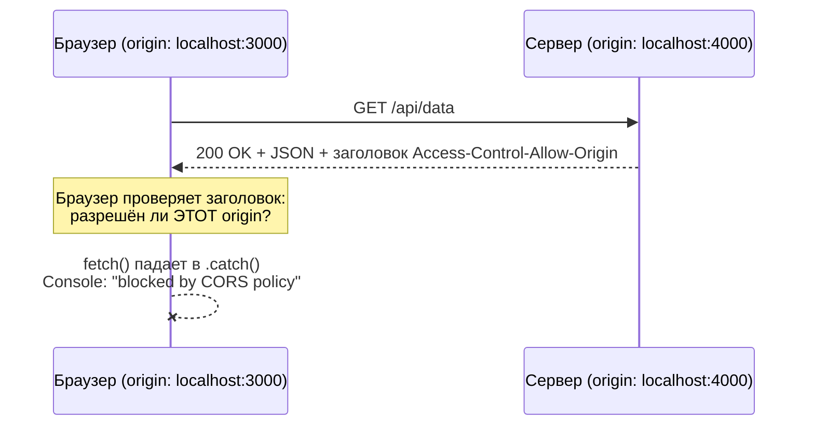
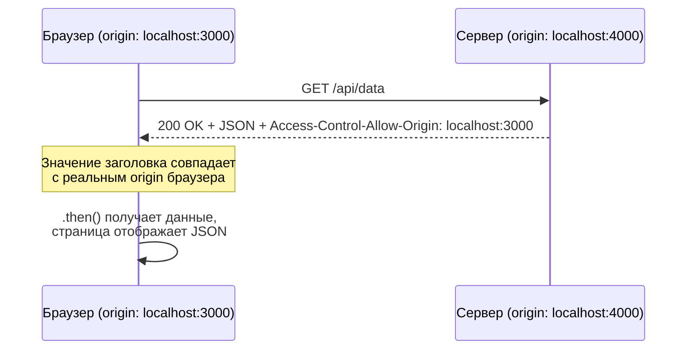

# CORS Playground — v1.1: заголовок есть, но не помогает

**Прогресс по roadmap:** пройдено 2 из 6 версий (осталось: 4)

## Участники

- **Фронтенд** — `http://localhost:3000`
- **Бэкенд** — `http://localhost:4000`

## Условие

В v1.0 мы научились чинить CORS, добавив заголовок `Access-Control-Allow-Origin` на сервере. Сейчас заголовок на месте — но ошибка в консоли всё равно есть, и текст ошибки **выглядит один в один как в v1.0**.

## Задача

1. Воспроизведи ошибку, открой вкладку Network → ответ на `/api/data` → Response Headers.
2. Сравни значение заголовка `Access-Control-Allow-Origin` с тем, откуда реально пришёл запрос (адресная строка браузера).
3. Сформулируй гипотезу: почему заголовок есть, а браузер всё равно блокирует?
4. Почини на сервере — [server/server.js](server/server.js).

**Подсказка, если застрял:** заголовок в CORS — это не «включить/выключить», а конкретное значение, которое браузер сверяет строка-в-строку с `Origin` запроса. Никаких wildcard-подстановок вида `localhost:*` не существует.

**Как понять, что фикс сработал:** ошибка в Console исчезает, на странице вместо `Error: ...` отображается JSON.

---

## Решение

Заголовок был захардкожен на `http://localhost:3001`, а фронт реально работает на `http://localhost:3000`. Браузер сравнивает значение `Access-Control-Allow-Origin` со своим собственным origin **буквально**, без масок и подстановок — несовпадение хотя бы в порте достаточно, чтобы получить ту же самую ошибку, что и при полном отсутствии заголовка.

**Вывод:** ошибка "blocked by CORS policy" — это не одна причина, а целый класс проблем. Текст ошибки в консоли одинаковый и для "заголовка нет", и для "заголовок не тот" — разбираться нужно всегда через Network → Response Headers, а не по тексту ошибки.
