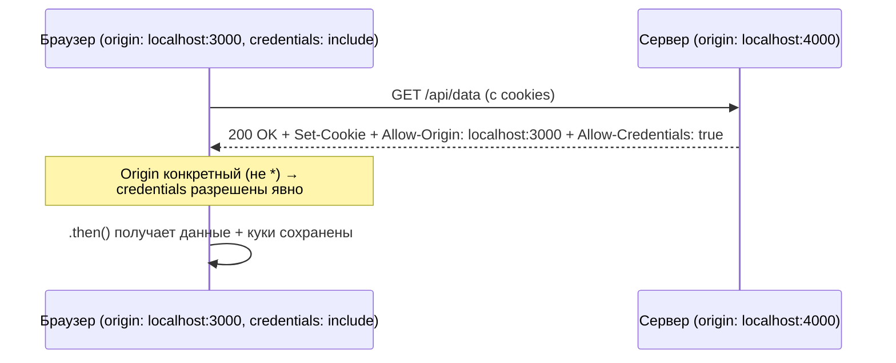

# CORS Playground — v2.0: credentials и wildcard origin

**Прогресс по roadmap:** пройдено 4 из 6 версий (осталось: 2)

- Сделано: v1.0, v1.1, v1.2, v2.0
- Следующий шаг: v2.1 — открой ветку `git checkout v2.1-broken`

## Участники

- **Фронтенд** — `http://localhost:3000`
- **Бэкенд** — `http://localhost:4000`

## Условие

Запрос снова простой `GET`, без кастомных заголовков — preflight (v1.2) тут ни при чём. Но фронт теперь запрашивает данные **с credentials** (`credentials: 'include'` — браузер должен приложить куки к запросу), а сервер пытается выставить сессионную куку в ответ. И всё равно `blocked by CORS policy`.

## Задача

1. Посмотри Network → ответ на `/api/data` → Response Headers. Что стоит в `Access-Control-Allow-Origin`?
2. Прочитай текст ошибки в Console целиком — он в этот раз **не такой**, как в v1.0/v1.1. Что конкретно там написано про credentials?
3. Подумай: почему браузеру не всё равно, что стоит в `Access-Control-Allow-Origin`, когда запрос идёт с credentials? Что плохого могло бы произойти, если бы `*` работал с credentials так же, как без них?
4. Почини на сервере — [server/server.js](server/server.js).

**Подсказка, если застрял:** `*` в `Access-Control-Allow-Origin` означает «разрешаю читать ответ вообще всем сайтам в интернете». Для запроса без credentials это относительно безопасно — там нет ничего личного. А что если этот же `*` разрешить для запроса, в котором браузер отправляет куки текущего пользователя?

**Как понять, что фикс сработал:** ошибка в Console исчезает, на странице отображается JSON, во вкладке Application → Cookies видна `session`-кука для `localhost:4000`.

---

## Решение

Спецификация CORS прямо запрещает комбинацию `Access-Control-Allow-Origin: *` с credentialed-запросом (`credentials: 'include'`) — браузер блокирует такой ответ сам, не дожидаясь, пока сервер сделает что-то плохое. Причина: `*` означает «любой сайт», а credentials — это куки текущего пользователя; вместе это означало бы, что любой сайт в интернете может от лица пользователя читать его приватные данные с этого сервера.

Фикс — два изменения одновременно:

- `Access-Control-Allow-Origin` — конкретный origin вместо `*` (как в v1.0/v1.1).
- `Access-Control-Allow-Credentials: true` — отдельный заголовок, явно разрешающий браузеру передать ответ дальше в JS вместе с cookies.

**Вывод:** `*` и «разрешить всем, включая сессии» — это не одно и то же. Как только в запросе появляются credentials (cookies, HTTP auth), wildcard origin автоматически становится недопустимым — сервер обязан назвать origin по имени.
